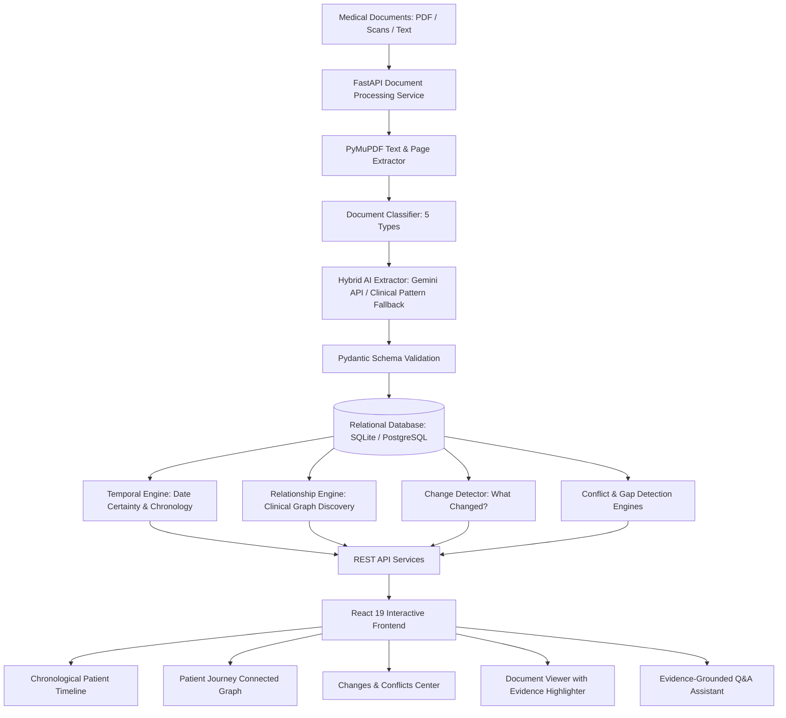

# Evidence-Linked Patient Journey (HE-05)
### Medical Document Intelligence & Longitudinal Patient Timeline

> **Hackathon Track:** HE-05 — Medical Document Intelligence & Patient Timeline  
> **Team:** 3 Student Developers  
> **Status:** Production-Ready Hackathon Working Prototype  
> **Live Local URL:** [http://127.0.0.1:8000](http://127.0.0.1:8000) (or Vite dev server: [http://localhost:5173](http://localhost:5173))

---

## 1. Problem Statement

Medical information belonging to the same patient is fragmented across diverse document formats and clinical encounters:
- Laboratory panels with numerical reference intervals
- Outpatient prescriptions with dosing titrations
- Specialist clinical consultation notes
- Radiology and diagnostic ultrasound reports
- Inpatient hospital discharge summaries

Traditional approaches either produce generic unstructured LLM summaries (which cannot be verified) or function as diagnostic engines (which carry significant clinical liability). 

**HE-05 Primary Source of Truth:**
The goal is to transform fragmented medical documents into a **structured, chronological, evidence-linked patient history** that answers:
- **WHAT** happened?
- **WHEN** did it happen? (Distinguishing actual event date vs document creation date)
- **HOW** are events related?
- **WHAT** changed over time?
- **WHERE** did this information come from? (100% verifiable source document and quote traceability)
- **ARE THERE CONFLICTS OR UNMONITORED GAPS?** (Clear flags rather than inventing data)

---

## 2. Our Solution & Key Innovations

Instead of treating an LLM as the "database of truth", our system uses **Source Documents as the Evidence Base**:
1. **Heterogeneous Document Understanding**: Ingests, parses, and classifies 5 core medical document types (Lab reports, Prescriptions, Clinical notes, Imaging reports, Discharge summaries) using PyMuPDF and character-level boundary indexing.
2. **Hybrid AI & Clinical Pattern Engine**: Uses Gemini API with strict structured JSON schema output when configured, with a deterministic Clinical Pattern Extractor fallback for guaranteed offline reliability during live demos.
3. **Temporal Reasoning Engine**: Explicitly decouples **Document Date** (creation) from **Event Date** (occurrence), categorizing date certainty into `explicit`, `relative`, `approximate`, or `unknown`.
4. **Longitudinal "What Changed?" Tracking**: Automatically detects shifts in medication regimens (dose increases, holds, discontinuations) and tracks numerical lab trends over time (e.g., HbA1c, Serum Creatinine, eGFR).
5. **Cross-Record Conflict Detection**: Flags clinical contradictions (e.g. Document 2 documenting Penicillin allergy vs Document 5 documenting NKDA / No Known Allergies) and guides the user to verify original records without guessing medical correctness.
6. **Timeline Gap Detection**: Detects extended unmonitored care intervals between acute milestones without inventing missing clinical events.
7. **100% Traceable Evidence Linkage**: Every single timeline event links directly to its source document name, page number, and verbatim supporting quote snippet, viewable in an in-app document inspector.
8. **Evidence-Grounded Patient History Q&A**: Answers queries using ONLY facts extracted from records with citations, cleanly refusing out-of-scope queries.

---

## 3. System Architecture



---

## 4. Technology Stack

- **Frontend**: React 19, Vite, Lucide Icons, Custom Healthcare CSS Design System (Accessible contrast, Glassmorphism, Micro-animations)
- **Backend**: Python 3.14 / 3.11+, FastAPI, Uvicorn, Pydantic V2
- **Document Processing**: PyMuPDF (`fitz`), `pypdf`, Pillow
- **AI & Extraction**: Google GenAI SDK (`gemini-2.5-flash`) + High-Precision Clinical Pattern Engine
- **Database**: SQLite (default zero-configuration) / PostgreSQL via SQLAlchemy ORM
- **Testing**: `pytest`, `pytest-asyncio`, FastAPI `TestClient`

---

## 5. Repository Structure

```
he05-patient-journey/
├── backend/
│   ├── app/
│   │   ├── main.py                  # FastAPI app, CORS, static mounting
│   │   ├── api/                     # REST API routers
│   │   │   ├── patients.py          # Patient CRUD & 1-click demo seeder
│   │   │   ├── documents.py         # Multi-file upload, processing, download
│   │   │   ├── timeline.py          # Chronological timeline & event lookup
│   │   │   ├── intelligence.py      # Relationships, changes, conflicts, gaps
│   │   │   └── qa.py                # Grounded Q&A endpoint
│   │   ├── database/
│   │   │   ├── connection.py        # SQLAlchemy engine & session factory
│   │   │   └── models.py            # Relational database models
│   │   ├── schemas/
│   │   │   └── models.py            # Pydantic V2 schemas & validation
│   │   ├── document_processing/
│   │   │   ├── extractor.py         # PyMuPDF text & page extractor
│   │   │   └── classifier.py        # 5-type document classification
│   │   ├── ai/
│   │   │   ├── gemini_extractor.py  # Structured JSON Gemini extractor
│   │   │   ├── rule_extractor.py    # Clinical regex & NLP pattern extractor
│   │   │   └── hybrid_pipeline.py   # Hybrid orchestrator with auto-fallback
│   │   ├── services/
│   │   │   ├── temporal_engine.py   # Event date vs doc date & certainty
│   │   │   ├── relationship_engine.py # Typed event relationships
│   │   │   ├── change_detector.py   # "What Changed?" detector
│   │   │   ├── conflict_detector.py # Cross-record discrepancy detector
│   │   │   ├── gap_detector.py      # Timeline gap detector
│   │   │   └── qa_engine.py         # Evidence-based QA assistant
│   │   └── demo_data/
│   │       └── synthetic_dataset.py # 5 synthetic PDFs & patient seeder
│   ├── tests/                       # Complete automated test suite
│   │   ├── test_api.py
│   │   ├── test_classifier.py
│   │   ├── test_extractor.py
│   │   └── test_intelligence.py
│   ├── requirements.txt
│   └── .env.example
├── frontend/
│   ├── src/
│   │   ├── components/
│   │   │   ├── Navbar.jsx
│   │   │   ├── MedicalSafetyBanner.jsx
│   │   │   ├── DashboardView.jsx
│   │   │   ├── DocumentUploader.jsx
│   │   │   ├── ProcessingPipeline.jsx
│   │   │   ├── TimelineView.jsx
│   │   │   ├── EventDetailModal.jsx
│   │   │   ├── PatientJourneyGraph.jsx
│   │   │   ├── ChangesConflictsView.jsx
│   │   │   ├── DocumentViewer.jsx
│   │   │   └── EvidenceQA.jsx
│   │   ├── services/
│   │   │   └── js               # Frontend API client
│   │   ├── App.jsx
│   │   ├── App.css
│   │   ├── index.css
│   │   └── main.jsx
│   ├── package.json
│   └── vite.config.js
└── README.md
```

---

## 6. Installation & Quick Start

### Prerequisites
- Python 3.10+ (Tested on Python 3.14)
- Node.js 18+ and npm

### Backend Setup
```bash
cd backend
python -m pip install -r requirements.txt
cp .env.example .env   # (Optional: add GEMINI_API_KEY if desired)
python -m uvicorn app.main:app --port 8000 --reload
```

### Frontend Setup
```bash
cd frontend
npm install
npm run dev
```
Open [http://localhost:5173](http://localhost:5173) in your browser.  
*(Note: Because the production build is mounted inside FastAPI, you can also view the entire full-stack app directly at [http://127.0.0.1:8000](http://127.0.0.1:8000)!)*

---

## 7. Synthetic Demo Patient & 3-Minute Demo Workflow

Click the **"Load Demo Patient"** button in the top navigation bar to instantly ingest and process the complete 5-document longitudinal journey for synthetic patient **Sarah Jenkins (54F)**:

1. **01_Initial_Lab_Report_Jan2026.pdf (10 Jan 2026)**:
   - HbA1c 9.4% (Elevated), Fasting Glucose 210 mg/dL, eGFR 72, BP 142/88.
2. **02_Endocrinology_Clinical_Consult_Jan2026.pdf (15 Jan 2026)**:
   - Type 2 Diabetes diagnosed; Metformin 500mg daily started; Lisinopril 10mg started.
   - Penicillin allergy documented: Severe urticaria and facial angioedema.
3. **03_Cardiology_Prescription_Feb2026.pdf (18 Feb 2026)**:
   - Metformin increased to 1000mg BID; Lisinopril 10mg refilled.
4. **04_Renal_Ultrasound_Imaging_May2026.pdf (12 May 2026)**:
   - Bilateral renal ultrasound: Mild cortical thinning, no hydronephrosis.
5. **05_Hospital_Discharge_Summary_Aug2026.pdf (19 Aug 2026)**:
   - Acute gastroenteritis with dehydration and AKI.
   - Metformin held; Insulin Glargine 18 units started.
   - **Injected Conflict**: Intake record incorrectly notes "Allergies: NKDA / None recorded".
   - **Demonstrated Gap**: 94-day unmonitored interval between May ultrasound and August admission.

### Demo Steps:
1. **Dashboard**: View summary stats, active patient card, and timeline span (221 days).
2. **Documents**: Inspect uploaded documents with auto-classified pills and processing status.
3. **Timeline**: Review chronological events, filter by event type or date certainty (`Explicit`, `Relative`, `Approximate`, `Unknown`), and view verbatim evidence quotes.
4. **Event Details**: Click any event card to view the deep-dive modal, event vs document date comparison, and supporting text snippet.
5. **Patient Journey Graph**: View connected progression milestones (`test → finding → consultation → treatment → discharge`).
6. **Changes & Conflicts**:
   - Check **"What Changed?"**: View Metformin dose changes (500mg → 1000mg → Held) and lab trajectories.
   - Check **"⚠️ Potential Conflicts"**: Inspect side-by-side Penicillin vs NKDA evidence comparison.
   - Check **"Timeline Gaps"**: Inspect the detected 94-day lapse without intermediate records.
7. **Document Viewer**: Select a document, view raw text, and see the exact evidence snippet highlighted.
8. **Evidence Q&A**: Ask "When was Metformin first prescribed and what was the dose?" (returns exact date and quote citation). Then ask "Has the patient ever had a heart transplant?" (returns strict refusal: "I could not find sufficient evidence in the uploaded records.").

---

## 8. Running Automated Tests

Run the full pytest test suite from the `backend/` directory:
```bash
cd backend
python -m pytest -v
```
All 17 tests validate extraction, classification, temporal reasoning, relationships, changes, conflicts, gaps, and grounded Q&A.

---

## 9. Medical Safety Disclaimer

> **IMPORTANT NOTICE:**  
> This system is built strictly for demonstration and medical document intelligence. It does **not** provide clinical diagnosis, propose treatments, prescribe medications, or predict outcomes. It does **not** arbitrate medical truth between conflicting records. All demo data is 100% synthetic. Always consult qualified healthcare professionals and original records.
